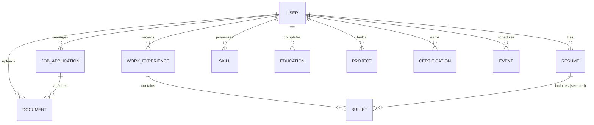

# AI Developer Guide - Job Application Tracker

This file serves as a comprehensive system guide and technical reference for AI assistants (like Claude/Gemini) interacting with the **Job Application Tracker** project. It outlines the architecture, database models, AI integrations, key REST API endpoints, and development workflows.

---

## 🚀 1. System Overview & Core Features
The **Job Application Tracker** is a full-stack web application designed to help job seekers manage their applications, build custom resumes, generate cover letters, and track follow-up events.

### Core Capabilities:
1. **Job Application Tracking**: Create, list, edit, and delete job applications with statuses (e.g., *Applied*, *Interviewing*, *Offered*, *Rejected*).
2. **Dynamic Resume Builder**: 
   - Manage master lists of work experiences, bullet points, skills, certifications, publications, awards, education, and projects.
   - Create custom resumes and dynamically select (toggle) which specific experience bullet points to include.
3. **Keyword Matching & Scoring**: Analyze job description text against a resume's selected content and user skills, returning a compatibility score and highlighting matched/missing keywords.
4. **Google Gemini AI Integrations**:
   - **Bullet Improvement**: Tailor specific resume bullet points using a job description context.
   - **Cover Letter Generation**: Create customized cover letters matching candidate details to a target job description.
   - **Live Job Search**: Use Google Search grounding to search for real-time active job listings across the web.
   - **AI Job Query Parsing**: Parse free-text search queries into database filters (keywords, company, location).
5. **Calendar/Event Scheduler**: Schedule follow-ups, interviews, and deadlines with email notifications.
6. **Document Manager**: Upload and store PDFs/Word docs (resumes, cover letters) linked to applications.

---

## 🛠️ 2. Technology Stack & Architecture

### Backend:
- **Framework**: Spring Boot 4.1.0 (Java 17)
- **Persistence**: Spring Data JPA / Hibernate
- **Database**: MySQL 8.x
- **Security**: Spring Security 6.x (Custom JWT-based authentication flow)
- **JSON Processing**: Jackson (`ObjectMapper`)
- **Utilities**: Lombok (`@Data`, `@Builder`, `@NoArgsConstructor`, etc.)
- **Email**: Spring Boot Starter Mail (configured for SMTP/Gmail)

### Frontend:
- Single-page experience served directly via Spring Boot's `/static` folder.
- **Languages**: HTML5, Vanilla JavaScript, CSS3 (Styling in `static/css/style.css`, API client in `static/js/api.js`).
- **Authentication**: JWT is stored in `sessionStorage` and attached to outgoing requests in the `Authorization: Bearer <token>` header by `apiRequest()` in `api.js`.

---

## 📁 3. Directory Layout

```
job-application-tracker/
├── pom.xml                               # Maven build configuration
├── HELP.md                               # Spring Boot default help file
├── mvnw / mvnw.cmd                       # Maven wrappers
├── src/
│   ├── main/
│   │   ├── java/com/example/jobapplicationtracker/
│   │   │   ├── JobApplicationTrackerApplication.java  # Main entry point
│   │   │   ├── controller/               # REST API endpoints (18 controllers)
│   │   │   ├── dto/                      # Data Transfer Objects (Payload models)
│   │   │   ├── exception/                # Global & custom exception handling
│   │   │   ├── model/                    # JPA Entities (Database mapping)
│   │   │   ├── repository/               # JPA Repositories (Database access)
│   │   │   ├── security/                 # Security Configuration & JWT Filters
│   │   │   └── service/                  # Business logic services
│   │   └── resources/
│   │       ├── application.properties    # Configuration file (DB, SMTP, Gemini API)
│   │       ├── static/                   # Frontend assets (HTML, CSS, JS)
│   │       │   ├── css/                  # Styling stylesheet (style.css)
│   │       │   ├── js/                   # Frontend JavaScript controllers
│   │       │   └── [html_files]          # index, login, dashboard, resume-builder
│   │       └── templates/                # Server-rendered templates (optional/fallback)
│   └── test/                             # Automated test suites
├── uploads/                              # Directory for uploaded document storage
└── target/                               # Compiled binaries / build outputs
```

---

## 🗄️ 4. Database Models & Schema Relationships

All entities are mapped to MySQL via JPA annotations in the `com.example.jobapplicationtracker.model` package.



### Main Entities & Definitions:
- **`User`**: Core user entity. Fields: `id`, `name`, `email` (unique), `password` (BCrypt encoded), `role` (default: `USER`).
- **`JobApplication`**: Tracks status, company, role, salary, date applied, notes, and platform.
- **`Resume`**: Named resume layouts. Contains a title/name and references `selectedBullets` (many-to-many relationship with `Bullet` via `resume_bullets` join table).
- **`WorkExperience`**: Company name, job title, location, duration, and bullet points.
- **`Bullet`**: Single-line accomplishment string belonging to a `WorkExperience`. Can be toggled on/off in individual resumes.
- **`Skill`**: Keyword tags associated with the `User` (e.g., Java, React).
- **`Event`**: Schedules notifications. Fields: `title`, `description`, `eventTime`, `eventType` (Interview, Follow-up, Deadline), `notificationSent` (boolean).

---

## 🔒 5. Authentication & Security Flow

Authentication is managed via Spring Security with JWT filters:
1. **Filter (`JwtAuthFilter`)**: Checks for incoming `Authorization: Bearer <token>` in the HTTP headers of all non-public endpoints.
2. **Token generation (`JwtUtil`)**: Issues access and refresh tokens upon login or register.
3. **Public Mappings**:
   - `/api/auth/**` (Registration, Login, Password Reset token generation/reset, Token Refresh)
   - Serves files under static folders `/index.html`, `/login.html`, `/register.html`, etc.
4. **Context Injection**: Controllers retrieve the logged-in user email using `SecurityUtils.getCurrentUserEmail()`.

---

## 🧠 6. Gemini AI Integrations
The `GeminiService` class handles all integrations with the Google Gemini API (usually configured to `gemini-3.5-flash`).

### 1. Job Description Filter Parsing (`parseJobQuery`)
Translates a user's natural language search query (e.g., *"Show me Spring Boot roles at Google in the USA"*) into structured JSON filters:
```json
{
  "keywords": "Spring Boot",
  "company": "Google",
  "country": "USA"
}
```
*Fallback: If API parsing fails, falls back to raw keyword search.*

### 2. Live Job Search (`searchLiveJobs`)
Uses the Gemini API with **Google Search grounding** (`"tools": [{"google_search": {}}]`) to search the web for active vacancies and returns parsed JSON arrays of:
`{ jobRole, companyName, location, salaryRange, workload, description, sourceUrl }`.

### 3. Cover Letter Generator (`generateCoverLetterText`)
Uses applicant context and a target job description to build a custom cover letter.

### 4. Bullet Point Optimizer (`BulletAiService`)
Refines and adjusts a resume bullet point's wording based on a target job description to maximize ATS matching.

---

## 📊 7. Keyword Analysis & Match Scoring
In `MatchScoreService`, a customized text parsing engine extracts:
1. **Multi-word technical phrases** (e.g., *"machine learning"*, *"Spring Boot"*).
2. **Capitalized acronyms** (e.g., *"AWS"*, *"REST"*, *"CI/CD"*).
3. **Single words** (excluding stopwords/generic job terms).

It computes a score:
$$\text{Score} = \left( \frac{\text{Matched Keywords}}{\text{Total Job Keywords}} \right) \times 100$$
It returns missing keywords sorted by frequency, so candidates know exactly what skills or terminology to add.

---

## ⚙️ 8. Local Setup & Commands

### Prerequisites:
- Java 17 installed
- MySQL 8.x running with database `job_tracker_db`
- API Key for Gemini set in system environment variables as `GEMINI_API_KEY`

### Configuration (`application.properties`):
```properties
spring.datasource.url=jdbc:mysql://localhost:3306/job_tracker_db
spring.datasource.username=root
spring.datasource.password=admin123

gemini.api.key=${GEMINI_API_KEY}
gemini.api.url=https://generativelanguage.googleapis.com/v1beta/models/gemini-3.5-flash:generateContent
```

### Maven Build & Run:
- **Build the application**:
  ```bash
  ./mvnw clean install
  ```
- **Run local server**:
  ```bash
  ./mvnw spring-boot:run
  ```
- **Access App**: `http://localhost:8080`

---

## 📝 9. AI Development Guardrails
When suggesting or writing code modifications:
- **Data Validation**: Ensure validation annotations (`@NotBlank`, `@Size`, etc.) are attached to DTOs and verified in controllers with `@Valid`.
- **Database Scope**: Keep transactions read-only (`@Transactional(readOnly = true)`) for search/query methods to avoid connection overhead.
- **Frontend Consistency**: Use the central fetch wrapper `apiRequest()` from [api.js](file:///d:/Desktop/spring-boot-project/job-application-tracker/src/main/resources/static/js/api.js) to automatically propagate JWT headers. Do not make direct raw `fetch()` calls for secured endpoints.
- **Lombok**: Always leverage Lombok annotations to keep model and DTO files clean and boilerplate-free.
